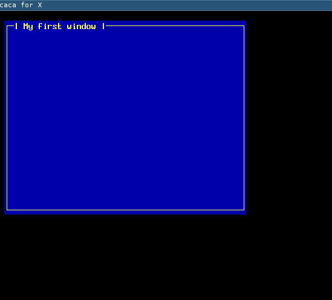

# GTcaca

Graphical Toolkit on top of libcaca.

It allows you to use widgets and have an amazing interface using code like this:

    #include <gtcaca/main.h>
    #include <gtcaca/window.h>
    
    int main(int argc, char **argv)
    {
      gtcaca_textlist_widget_t *textlist;
      
      gtcaca_init(&argc, &argv);
    
      gtcaca_window_new("My first window", 1, 1, 50, 20);

      gtcaca_main();
      return 0;
    }

Which will make the following:

# License

This is released under public domain.
