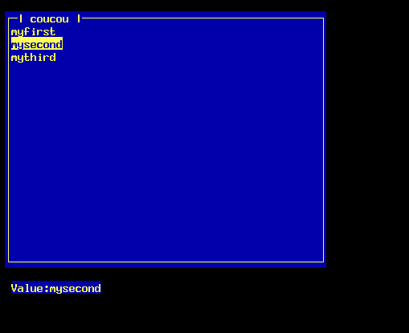

# GTcaca

Graphical Toolkit on top of libcaca.

It allows you to use widgets and have an amazing interface using code like this:

    #include <gtcaca/main.h>
    #include <gtcaca/window.h>
    
    int main(int argc, char **argv)
    {
      gtcaca_init(&argc, &argv);
    
      gtcaca_window_new("My first window", 1, 1, 50, 20);

      gtcaca_main();
      return 0;
    }

Which will make the following:

## Text List widget

This code:

    #include <gtcaca/main.h>
    #include <gtcaca/window.h>
    #include <gtcaca/textlist.h>
    
    int textlist_key_press(gtcaca_textlist_widget_t *widget, int key, void *userdata)
    {
      switch(key) {
      case CACA_KEY_RETURN:
        caca_printf(gmo.cv, widget->x, widget->y + 20, "Value:%s", gtcaca_textlist_get_selected(widget));
        break;
      }
    }
    
    int main(int argc, char **argv)
    {
      gtcaca_textlist_widget_t *textlist;
      
      gtcaca_init(&argc, &argv);
    
      gtcaca_window_new("coucou", 1, 1, 50, 20);
    
      textlist = gtcaca_textlist_new(2, 2);
      gtcaca_textlist_append(textlist, "myfirst");
      gtcaca_textlist_append(textlist, "mysecond");
      gtcaca_textlist_append(textlist, "mythird");
    
      gtcaca_textlist_key_cb_register(textlist, textlist_key_press);
      
      gtcaca_main();
      return 0;
    }

Which will make this:

When the user pressed the RETURN key, we printed the value of the selection.

# License

This is released under public domain.
