# gtcaca widget gallery

Every widget in the toolkit, with a screenshot of what it looks like and the
call that creates it. All screenshots are rendered straight from the widgets
(`docs/images/*.png`) — this is exactly how they draw in a terminal.

Each widget is created with `gtcaca_<name>_new(parent, …)`, drawn by the main
loop, and (where interactive) fed keys through `gtcaca_<name>_key()`. Add one to
a window and `gtcaca_main()` takes care of the rest. See [editor.md](editor.md)
for the editor and the apps under [`apps/`](../apps/) (`cacamacs`, `cacasheet`,
`rfmind`, `rtodo`) for complete programs.

> **Flip through these live:** run [`demo_gallery`](../demo/demo_gallery.c)
> (`./build/demo/demo_gallery`) and use **←/→** (or **p/n**) to step through
> every widget below, **q** to quit.

---

## Form controls

### Label
Static text.

`gtcaca_label_new(parent, "Hello, gtcaca!", x, y)`

### Button
A push button; shows a focused style when selected.

`gtcaca_button_new(parent, "OK", x, y)` · `gtcaca_button_key_cb_register(b, cb)`

### Entry
Single-line text input (with an optional secret/password mode).

`gtcaca_entry_new(parent, x, y, width)` · `gtcaca_entry_set_text()` · `gtcaca_entry_set_secret()`

### Checkbox
A toggle with a label.

`gtcaca_checkbox_new(parent, "Enable sound", x, y)` · `gtcaca_checkbox_set_checked()`

### Radio button
Mutually-exclusive choice within a group.

`gtcaca_radiobutton_new(parent, "Small", group_id, x, y)` · `gtcaca_radiobutton_set_active()`

### Combo box
A drop-down list of choices.

`gtcaca_combobox_new(parent, x, y, width)` · `gtcaca_combobox_append()`

### Switch
An on/off toggle.

`gtcaca_switch_new(parent, x, y)` · `gtcaca_switch_set_active()`

### Scale (slider)
Pick a value in a range by sliding.

`gtcaca_scale_new(parent, x, y, width, min, max, step)` · `gtcaca_scale_set_value()`

### Spin button
Numeric field with up/down adjustment.

`gtcaca_spinbutton_new(parent, x, y, min, max, step)` · `gtcaca_spinbutton_set_value()`

### Progress bar
Determinate progress, 0…1.

`gtcaca_progressbar_new(parent, x, y, width)` · `gtcaca_progressbar_set_value(p, 0.62f)`

---

## Lists, text & layout

### Text list
A selectable, scrollable list.

`gtcaca_textlist_new(parent, x, y)` · `gtcaca_textlist_append()`

### Text view
A scrollable, read-only block of text.
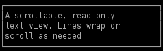
`gtcaca_textview_new(parent, x, y, width, height)` · `gtcaca_textview_append()`

### Status bar
A bottom-of-screen status line.

`gtcaca_statusbar_new(" Ready … ")` · `gtcaca_statusbar_set_text()`

### Frame
A titled box that groups other widgets.
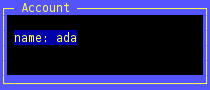
`gtcaca_frame_new(parent, "Account", x, y, width, height)`

### Separator
A horizontal or vertical divider rule.

`gtcaca_separator_new(parent, x, y, length, vertical)`

### Expander
A collapsible section that shows/hides managed widgets.

`gtcaca_expander_new(parent, "Advanced options", x, y, width)` · `gtcaca_expander_set_expanded()` · `gtcaca_expander_add_managed()`

### Tabs
A tabbed bar (the body for the selected tab is yours to draw). Left/Right/Tab switch.
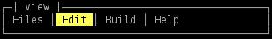
`gtcaca_tabs_new(parent, x, y, width, height)` · `gtcaca_tabs_set_titles()`

---

## Data & dashboards

### Sparkline
A compact inline trend chart.

`gtcaca_sparkline_new(parent, x, y, width, height)` · `gtcaca_sparkline_set_data()`

### Gauge
A horizontal percentage bar.

`gtcaca_gauge_new(parent, x, y, width)` · `gtcaca_gauge_set_percent(g, 72)`

### Bar chart
Labelled vertical bars.
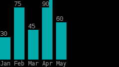
`gtcaca_barchart_new(parent, x, y, width, height)` · `gtcaca_barchart_set_data(b, values, labels, n)`

### Line chart
An auto-scaled XY plot with one or more series and a labelled axis.
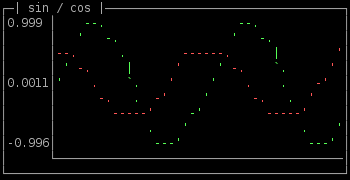
`gtcaca_linechart_new(parent, x, y, width, height)` · `gtcaca_linechart_add_series(c, y, n, colour)`

### Seven-segment display
Big "LED" digits for clocks and counters (0-9, A-F, `:` `-`).
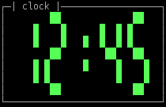
`gtcaca_segdisplay_new(parent, x, y, width, height)` · `gtcaca_segdisplay_set_text(s, "12:45")`

### Tree (lazy model/view)
A hierarchy backed by a model — handles **billions** of nodes because only the
visible rows are ever queried. Right/Left expand/collapse.
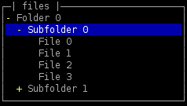
`gtcaca_tree_new(…)` · `gtcaca_tree_set_model(t, &model)`

### Table (lazy model/view)
A grid backed by a model (row/column/cell callbacks); also scales to huge
datasets. Arrows move the current cell.
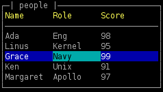
`gtcaca_table_new(…)` · `gtcaca_table_set_model(t, &model)` · `gtcaca_table_set_current()`

### Map (geoview)
An equirectangular world map with a built-in low-res outline and a gazetteer of
124 world capitals & major cities — plot places by name. Arrows hop between markers.
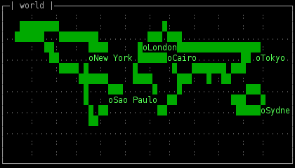
`gtcaca_map_add_world(m, CACA_GREEN)` · `gtcaca_map_add_city(m, "Tokyo", 'o', colour)` · `gtcaca_map_find_city()`

### Calendar
A month grid with weekend colouring, "today", a selection, and per-day marker
dots. Arrows move by day/week, PageUp/Down change month.
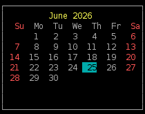
`gtcaca_calendar_new(…)` · `gtcaca_calendar_set_date()` · `gtcaca_calendar_set_marker()`

### Mind map (FreeMind-style)
A left-rooted horizontal tree joined by box-drawing connectors; any node folds
(folded nodes show a `+`). Reads/writes FreeMind `.mm` (see the `rfmind` app).
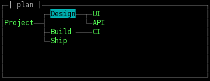
`gtcaca_mindmap_new(…)` · `gtcaca_mindmap_add_child()` · `gtcaca_mindmap_add_sibling()`

---

## Editor & modals

### Editor
A full text-editing widget: document model, caret/selection, undo, soft wrap,
syntax colourization, code folding and annotations. Powers `cacamacs`.
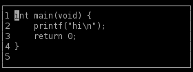
`gtcaca_editor_new(parent, x, y, width, height)` · `gtcaca_editor_set_text()` — full reference in [editor.md](editor.md)

### Dialog (modal)
A centred message/confirm/choice box. Left/Right/Tab move, Enter chooses, Esc cancels.
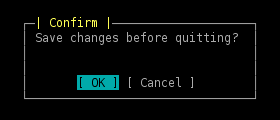
`gtcaca_dialog_run(title, msg, buttons, n)` · `gtcaca_dialog_confirm()` · `gtcaca_dialog_message()`

### File chooser (modal)
A directory browser (folders first) for opening or saving. Up/Down move, Enter
descends/chooses, Esc cancels; save mode has an editable name field.
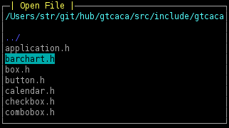
`gtcaca_filechooser_run(start_dir, out_path, len, save_mode)`

---

*A couple of widgets aren't pictured here: the **spinner** (a one-cell animated
busy indicator, `gtcaca_spinner_new`) and the **menu** bar (`gtcaca_menu_new` +
`gtcaca_menu_add_entry`/`add_item`), both of which are best seen live — see the
demos under [`demo/`](../demo/).*
